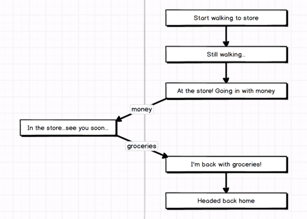
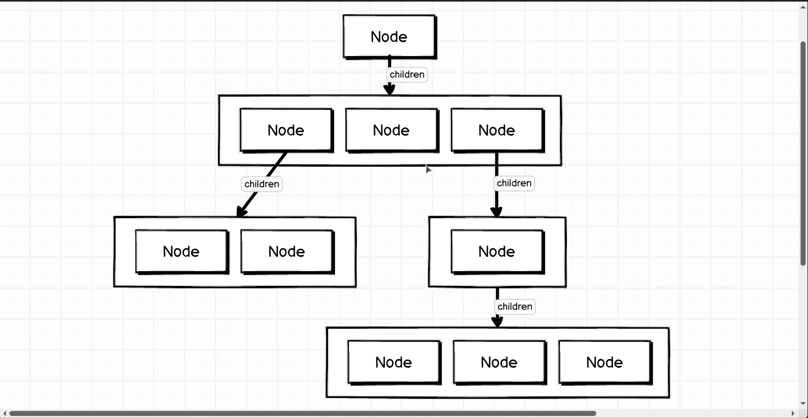

# Generators

## What is a generator?
* Plain definition
  * Generator is a function that can be entered and exited multiple times.
  * Unlike a function that is run and done (tehehe)
* Code Example
```javascript
function* numbers() {
    yield;
}

const gen = numbers();
console.log(gen.next()); //{ value: undefined, done: false }
console.log(gen.next()); //{ value: undefined, done: true }

function *numbersNoYield() {}; /* alternative syntax */
const genAlt = numbersNoYield();
console.log(genAlt.next()); // { value: undefined, done: true }
console.log(genAlt.next()); // { value: undefined, done: true }
```
* `yield` is a keyword added with ES6
  * tba
* `.next()` 
### S.Grider's Analogy || Short Story

  * Walk from house to store along the **sidewalk**
  * Go from the sidewalk to the store with money
  * Come from the store to the sidewalk no longer with money, but with groceries
* Code Version of Short Story
```javascript
function* shopping() {
    // stuff on the sidewalk

    // walking down the sidwalk

    // go into the store with cash
    const stuffFromStore = yield 'cash';
    // walking to laundromat
    const cleanClothes = yield 'laundry';

    // walking back home
    return [stuffFromStore, cleanClothes];
};

// stuff in the store
const gen = shopping();
console.log(gen.next()); // leaving our house
// walked into the store
// walking up and down the aisles..
// purchase our stuff
console.log(gen.next('groceries')); // leaving the store with groceries
console.log(gen.next('clean clothes'));

/* 
RESULT
{
    value: 'cash',
    done: false
} {
    value: 'laundry',
    done: false
} {
    value: ['groceries', 'clean clothes'],
    done: true
}
*/
```
* The first `.next` starts the generator
* The `yield` keyword acts as the money arrow in the diagram above allowing transition from inside the function to outside the function.
* The second `.next` takes us back to the generator. In this case it sort of replaces 'cash' with 'groceries'
* **KEY TAKEAWAY**
  * yield stops execution of the generator and exits with a value
  * then more code can take place
  * generator is re-entered to resume generator execution with a passed-in variable.
### More Practical Example with Generators
```javascript
function* colors() {
    yield 'red';
    yield 'blue';
    yield 'green';
};

const gen = colors();
console.log(gen.next());
console.log(gen.next());
console.log(gen.next());
console.log(gen.next());

/*
RESULTS
{
    value: 'red',
    done: false
} {
    value: 'blue',
    done: false
} {
    value: 'green',
    done: false
} {
    value: undefined,
    done: true
}
*/
```
## What does a generator do?
They work beauitfully with `for...of` loops
```javascript
const engineeringTeam = {
    size: 3,
    department: 'Engineering',
    lead: 'Jill',
    manager: 'Alex',
    engineer: 'Dave'
};

function* teamIterator(team) {
    yield team.lead;
    yield team.manager;
    yield team.engineer;
}

const names = [];
for (let name of teamIterator(engineeringTeam)) {
    names.push(name);
};
console.log(names); //[ 'Jill', 'Alex', 'Dave' ]
```

This is an example of delegating generators. Compare this code example to the one above:
```javascript
const testingTeam = {
    lead: 'Amanda',
    tester: 'Bill'
};

const engineeringTeam = {
    testingTeam,
    size: 3,
    department: 'Engineering',
    lead: 'Jill',
    manager: 'Alex',
    engineer: 'Dave'
};

function* teamIterator(team) {
    yield team.lead;
    yield team.manager;
    yield team.engineer;
    const testingTeamGenerator = testingTeamIterator(team.testingTeam);
    yield* testingTeamGenerator;
}

function* testingTeamIterator(team) {
    yield team.lead;
    yield team.tester;
}

const names = [];
for (let name of teamIterator(engineeringTeam)) {
    names.push(name);
};
console.log(names); //[ 'Jill', 'Alex', 'Dave', 'Amanda' , 'Bill' ]
```
### Practical Uses


Now if we added an independent testing team as a apart of the engineering team...
```javascript
const testingTeam = {
    lead: "Amanda",
    tester: "Bill"
};

const engineeringTeam = {
    testingTeam,
    size: 3,
    department: 'Engineering',
    lead: 'Jill',
    manager: 'Alex',
    engineer: 'Dave'
};
```

and we wanted the `teamIterator` to iterate over them as well, because with just the added team, we're still getting `[ 'Jill', 'Alex', 'Dave' ]` 

So we add a `testingTeamIterator` similar to the`teamIterator and add a `testingTeamGenerator` and a `yield*` keyword so the middle of this script looks like:
```javascript
function* teamIterator(team) {
    yield team.lead;
    yield team.manager;
    yield team.engineer;
    const testingTeamGenerator = testingTeamIterator(team.testingTeam);
    yield* testingTeamGenerator;
}

function* testingTeamIterator(team) {
    yield team.lead;
    yield team.tester;
}
```

Now we're outputting Amanda and Bill from the testing team.

* `yield*` acts as a trapdoor(???) that the iterator falls through and stays in.
  * If you just do `yield testingTeamGenerator` you'll receive `[ 'Jill', 'Alex', 'Dave', {} ]`

## Symbol.iterator with Generators

### Definition of Symbol.iterator
* Stephen's Simple Definition
  * A tool that teaches objects how to respond to the `for...of` loop
* From MDN
  * specifies the default iterator for an object. Used by `for...of`.
* Symbol Interpolation
  * **WHAT IS THAT?**

### Example

Symbol.iterator should allow us clean up our code. From the previous section, the full code example is 32 lines long:
```javascript
const testingTeam = {
    lead: "Amanda",
    tester: "Bill"
};

const engineeringTeam = {
    testingTeam,
    size: 3,
    department: 'Engineering',
    lead: 'Jill',
    manager: 'Alex',
    engineer: 'Dave'
};

function* teamIterator(team) {
    yield team.lead;
    yield team.manager;
    yield team.engineer;
    const testingTeamGenerator = testingTeamIterator(team.testingTeam);
    yield testingTeamGenerator;
}

function* testingTeamIterator(team) {
    yield team.lead;
    yield team.tester;
}

const names = [];
for (let name of teamIterator(engineeringTeam)) {
    names.push(name);
};
console.log(names); //[ 'Jill', 'Alex', 'Dave', 'Amanda', 'Bill' ]
```

Now the same logic is only 29 lines long:
```javascript
const testingTeam = {
    lead: "Amanda",
    tester: "Bill",
    [Symbol.iterator]: function* () {
        yield this.lead;
        yield this.tester;
    }
};

const engineeringTeam = {
    testingTeam,
    size: 3,
    department: 'Engineering',
    lead: 'Jill',
    manager: 'Alex',
    engineer: 'Dave',
    [Symbol.iterator]: function* () {
        yield this.lead;
        yield this.manager;
        yield this.engineer;
        yield* this.testingTeam;
    }
};

const names = [];
for (let name of engineeringTeam) {
    names.push(name);
};
console.log(names); //[ 'Jill', 'Alex', 'Dave', 'Amanda', 'Bill' ]
```

### What's Going On?
* `Symbol.iterator` is a special object included with ES6 that tells a `for...of` loop how to iterate over an object.
* Arrays have a default `Symbol.iterator` so they can be used with a `for...of` loop without customization;
* As the `for...of` loop goes through the generator, it will stop at every `yield` and returns the value to the right of the `yield` into the looper

## Practical Example with Generators
### Generators with Recursion

This is a tree, a common data structure

* Where would find trees? Well, you silly billy, look up the frack-a-lacking DOM.
* But also the comment section on Reddit.
  * Probably any nested data? I need to confirm that

```javascript
class Comment {
    constructor(content, children) {
        this.content = content;
        this.children = children;
    }

    *[Symbol.iterator]() {
        
    }
}

const children = [
    new Comment('good comment', []),
    new Comment('bad comment', []),
    new Comment('meh', [])
];
const tree = new Comment('Great post!', children);
console.log(tree);
/*
Comment {
    content: 'Great post!',
    children: [Comment {
            content: 'good comment',
            children: []
        },
        Comment {
            content: 'bad comment',
            children: []
        },
        Comment {
            content: 'meh',
            children: []
        }
    ]
}
*/
```
That's the top half of our node tree!

**NOTE! ARRAY HELPERS DO NOT WORK IN GENERATORS**
That's why you need to use the `for...of` loop

```javascript
class Comment {
    constructor(content, children) {
        this.content = content;
        this.children = children;
    }

    *[Symbol.iterator]() {
        yield this.content;
        for (let child of this.children) {
            yield* child;
        }
    }
}

const children = [
    new Comment('good comment', []),
    new Comment('bad comment', []),
    new Comment('meh', [])
];
const tree = new Comment('Great post!', children);

const values = [];
for (let value of tree) {
    values.push(value);
};
console.log(values);//['Great post!', 'good comment', 'bad comment', 'meh']
```