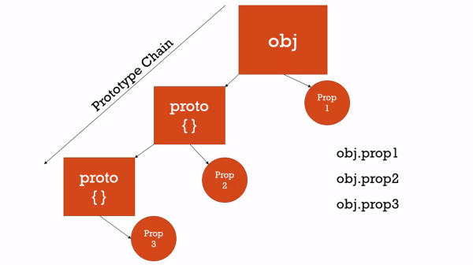

# Prototypal Inheritance

## Conceptual Aside: Classical vs. Prototypal Inheritance

* Classical Inheritance
  * What C# and Java and similar languages use
  * Very verbose
  * many keywords
* Prototypal Inheritance
  * One object gets access to the properties and methods of another object.
  * ...that's it.
  * Leads to a simple, flexible, extensible, and easy-to-understand principle

## Understanding the Prototype

* All objects have a prototype property which is simple reference to another object, proto which stands on its own.

* You can have additional objects point to the same prototype and can share properties.
* They aren't sharing propertyies and methods directly, but through the prototype chain
* Prototype Chain vs. Scope Chan
  * Whereas the scope chain is concerned with looking for where we have access to a variable, the prototype chan is concerned with where we have access to a property or method amongst a sequence of objects.

### Demo Code (DON'T TRY THIS AT HOME)

```javascript
let person = {
    firstName: 'Default',
    middleName: 'Default',
    lastName: 'Default',
    getFullName: function() {
        return `${this.firstName} ${this.middleName} ${this.lastName}`;
    }
};

let cpustejovsky = {
    firstName: 'Charles',
    lastName: 'Pustejosky'
}

cpustejovsky.__proto__ = person;

console.log(cpustejovsky.getFullName()); // Charles Default Pustejovsky

let jane = {
    firstName: 'Jane'
};

jane.__proto__ = person;

console.log(jane.getFullName()); // Jane Default Default
```

## Everything is an Object or a Primitive

* The only exception is the base object in JavaScript
```javascript
var a = {};
var b = function(){ };
var c = [];

console.log(a.__proto__); // {}
console.log(b.__proto__); // [Function]
console.log(c.__proto__); // []
```
* And all of these prototypes have the methods of objects and functions and arrays.

## Reflection and Extend

* Reflection: An object can look at itslef, listing and changing its properties and methods.
* **TODO: Learn more about extends**

## Function Constructors, 'new', and the History of JavaScript

* JavaScript named thusly to attract Java developers.
* Therefore you have code like:
```javascript
function Person(firstname = 'John', lastname = 'Doe') {
    console.log(this);
    this.firstname = firstname;
    this.lastname = lastname;
    console.log('This function is invoked.')
}
let johndoe = new Person();
console.log(johndoe);

let cpustejovsky = new Person('Charles', 'Pustejovsky');
console.log(cpustejovsky);

/*
Person {}
This function is invoked.
Person { firstname: 'John', lastname: 'Doe' }
Person {}
This function is invoked.
Person { firstname: 'Charles', lastname: 'Pustejovsky' }
*/
```
* This doesn't create a class since JavaScript doesn't really have classes
* `new` is actually an operator of Left-to-Right precedence
* It lets you construct an object via a function.. hence **function constructor**
  * Convention is to use a capital letter for the function constructor
* **WARNING**
  * If you forget to include the `new` operator, the JavaScript engine will:
    * execute the function
    * return undefined
    * leave you without any of those properties or methods
* Anyways, `new` creates an empty object
  * then calls the function 
    * then the function creates a `this` variable but `new` has `this` point to the empty object
      * then returns whatever the function does to `this`

### Function Constructors and `prototype`

The prototype of these constructed objects
```javascript
console.log(cpustejovsky); //Person { firstname: 'Charles', lastname: 'Pustejovsky' }
console.log(cpustejovsky.__proto__); //Person {}
```

* A function is a special type of object that in addition to the properties shared by all objects, has
  * a name property
  * a code property
    * "Invocable" ()
* And it also has a **prototype** property that starts out its life as an empty object but is only used by the `new` operator
* This is confusing because a function's prototype property is not the prototype of the function.
  * Rather, it is the prototype of any objects created by `new` from the function.
  * It is the origin of those objects prototype chain.
* You can add methods to child objects after they've been made.
* Generally, methods are added to the `.prototype` to save memory (they only need one) while having all the properties on the parent method.
```javascript
function Person(firstname = 'John', lastname = 'Doe') {
    // console.log(this);
    this.firstname = firstname;
    this.lastname = lastname;
    // console.log('This function is invoked.')
}

Person.prototype.getFullName = function() {
    return `${this.firstname} ${this.lastname}`;
}

let johndoe = new Person();
console.log(johndoe);
console.log(johndoe.getFullName());

let cpustejovsky = new Person('Charles', 'Pustejovsky');
console.log(cpustejovsky); //Person { firstname: 'Charles', lastname: 'Pustejovsky' }
console.log(cpustejovsky.getFullName()); // Charles Pustejovsky
```

### Built-in Function Constructors

* `Number(...);` returns an object with the primitive value *boxed* inside.
  * Has methods like `.toFixed`, etc. 
```javascript
"Charles".length //7
//It boxes in that string into the String object to run the `.length` method

//You can modify the String base object that will effect all strings
String.prototype.isLengthGreaterThan = function(limit) {
    return this.length > limit;
};

console.log("cpustejovsky".isLengthGreaterThan(3)); //true
console.log("cpustejovsky".isLengthGreaterThan(30)); //false

let a = new Number(3);

console.log(a);
console.log(a.toFixed(3));

console.log(a == 3);
console.log(a === 3);

let b = new String('hello, world!');

console.log(b);
console.log(b.toUpperCase());

console.log (b == 'hello, world!');
console.log (b === 'hello, world!');
```
* In the above example, the JavaScript engine boxes "Charles" into `String()`
* `Date()` is another example.
* **WARNING**
  * Beware of objects that boxed up a primitive like the above example because they'll look like primitives but will actually be objects.
  * Good ole `==` will coerce objects and primitives to be equal because it's the Mr. Meeseeks of JavaScript
    * "caaaan do!"

**ADDITIONAL WARNING**
* Don't use `for...in` because arrays are actually a type of object
  * And if a Framework adds a feature to the prototype, it will mess up the `for...in` looping because it'll include the new feature.
* So use standard iterators!
```javascript
Array.prototype.myCustomFeature = 'cool beans, bro!'

let arr = ['John', 'Jacob', 'Jingleheimer Schmidt'];

for (var prop in arr) {
    console.log(`${prop}: ${arr[prop]}`);
}
/* OUTPUT
0: John
1: Jacob
2: Jingleheimer Schmidt
myCustomFeature: cool beans, bro!
*/
```