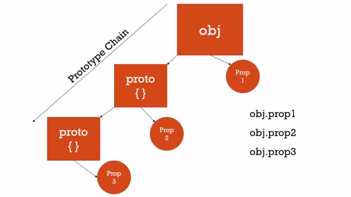

# Object Oriented Programming

## Conceptual Aside: Classical vs. Prototypal Inheritance

* Classical Inheritance
  * What C# and Java and similar languages use
  * Very verbose
  * many keywords
* Prototypal Inheritance
  * One object gets access to the properties and methods of another object.
  * ...that's it.
  * Leads to a simple, flexible, extensible, and easy-to-understand principle

## Understanding the Prototype

* All objects have a prototype property which is simple reference to another object, proto which stands on its own.

* You can have additional objects point to the same prototype and can share properties.
* They aren't sharing propertyies and methods directly, but through the prototype chain
* Prototype Chain vs. Scope Chan
  * Whereas the scope chain is concerned with looking for where we have access to a variable, the prototype chan is concerned with where we have access to a property or method amongst a sequence of objects.

### Demo Code (DON'T TRY THIS AT HOME)

```javascript
let person = {
    firstName: 'Default',
    middleName: 'Default',
    lastName: 'Default',
    getFullName: function() {
        return `${this.firstName} ${this.middleName} ${this.lastName}`;
    }
};

let cpustejovsky = {
    firstName: 'Charles',
    lastName: 'Pustejosky'
}

cpustejovsky.__proto__ = person;

console.log(cpustejovsky.getFullName()); // Charles Default Pustejovsky

let jane = {
    firstName: 'Jane'
};

jane.__proto__ = person;

console.log(jane.getFullName()); // Jane Default Default
```

## Everything is an Object or a Primitive

* The only exception is the base object in JavaScript
```javascript
var a = {};
var b = function(){ };
var c = [];

console.log(a.__proto__); // {}
console.log(b.__proto__); // [Function]
console.log(c.__proto__); // []
```
* And all of these prototypes have the methods of objects and functions and arrays.
* 