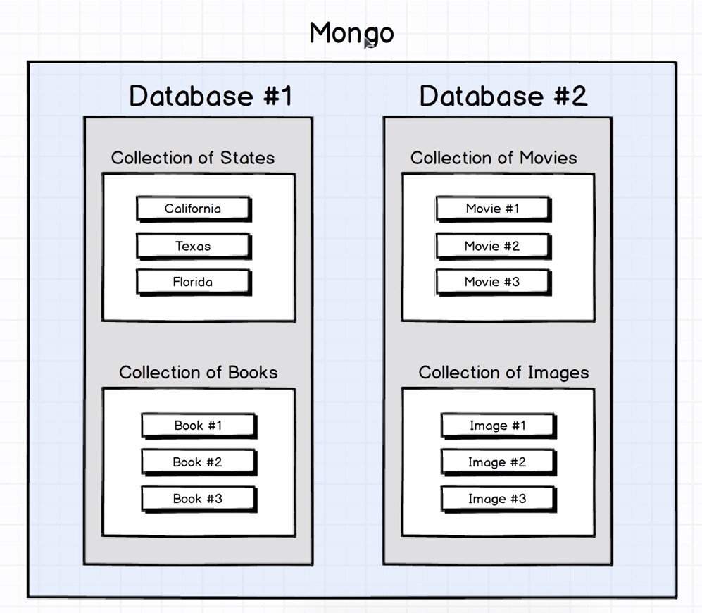
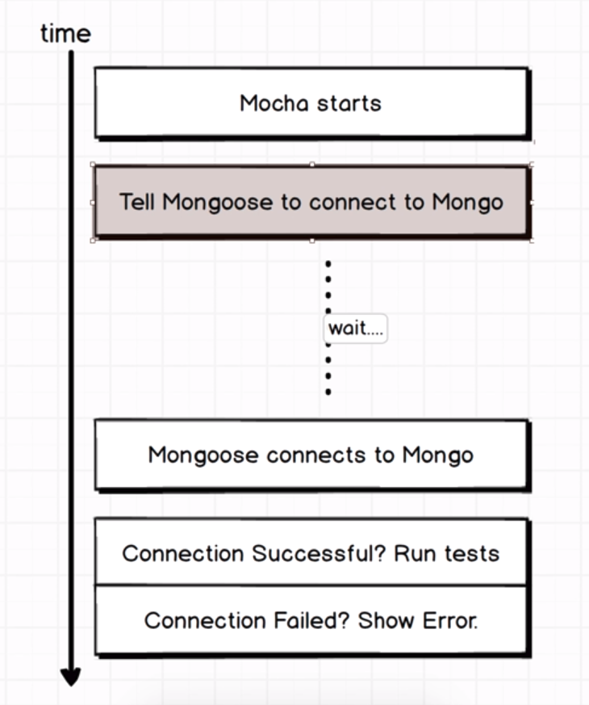
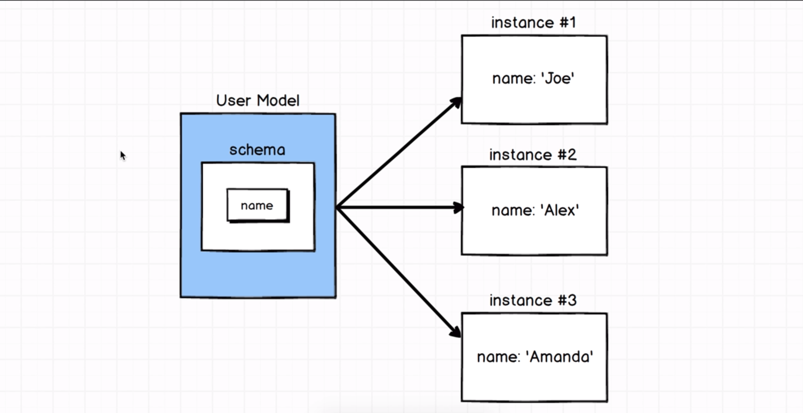

# MongoDB

## What is MongoDB?
* Database!
  * Used for storing persistent data in an application.
* Separated from the wide, wide, world wide web with a web server
  * In my own case, I'll be using NodeJS, but Ruby, Python, etc. all can also work
  * Where user permissions and similar security features live
* Mongoose is an **ORM or Object-Relational Mapping** Tool 
  * converts data between the NodeJS server and MongoDB

## MongoDB Data Storage
### Two Ideas!
First! We can have multiple internal databases inside of a single mongo instance

Second! We have **collections!**
* Core unit of what stores data inside a Mongo Database
* Store different types of data in these collections
* No mixing and matching!

## Core Mongoose/Mongo Operators
* Cread
* Read
* Update
* Destroy

## Notes on `users` repository

## Overview
Creating a collection of users, interacting with them with Mongoose, and testing with Mocha

## Structure
* `/src/`
  * `user.js`
    * Maps Mongoose and Mongo togetheer
* `/test/`
  * `create_test.js`
  * `read_test.js`
  * `update_test.js`
  * `destroy_test.js`

## Test Helper File
Found inside `/test/` and is called, well, `test_helper.js`

Looks like
```javascript
//bring in the Mongoose module
const mongoose = require('mongoose');
//assignment operator for ES6 Promises
mongoose.Promise = global.Promise;

//the before function makes sure that mongodb is connected before the tests begin
before((done) => {
    mongoose.connect('mongodb://localhost/users_test', {
        useNewUrlParser: true
    });
    mongoose.connection/*No semicolons because these are chained methods*/
        .once('open', () => { done(); })
        .on('error', (error) => {
            console.warn('Warning', error);
        });
})

// done does a bit of mocha magic to add asynchronisity
beforeEach((done) => {
    const { users, comments, blogposts } = mongoose.connection.collections;
    users.drop(() => {
        comments.drop(() => {
            blogposts.drop(() => {
                done();
            });
        });
    });
});
```
* This is where we put any code that is needed to set up our tests
* How our code executes when we run a command to test our project

* Mocha starts up
* Before that, Mongoose is a JavaScript package (not made of magic)
  * So we need to tell Mongoose to connect to Mongo which takes some amount of time.
* So we check whether Mongoose connected 

## Mongoose Models

* Mongoose models represent a record in a specific collection.
* From this model, we create instances which represent single records in our collection
* Models have a **schema** which describes the properties each record should have along with the data those properties should be.
* You can check out the user model in `/src/user.js`
  * At its most basic you:
    * require in mongoose and mongoose's Schema method
    * use mongoose's Schema to define your model's schema
    * use `mongoose.model('model', modelSchema);` to create your model
    * export your model

## Creating Model Instance
Example from `create_test.js`
```javascript
const joe = new User({ name: 'Joe'});
joe.save()
```
* without `joe.save()`, the joe User instance is not persisted to the database

## Finding Model Instances
Example from `reading_test.js`
```javascript
return User.find({ name: 'Joe' })
return User.findOne({
        _id: joe._id
    })
```
`joe._id` will look something like 5ca4a5d9e4a02d4f8b949c87 which is not s string but an object. 

### `.find()`
`.find(criteria)` Finds all the model instances that match the criteria provided in the form of an object and returns an array
### `.findOne`
`.findOne(criteria)` Finds the first model instance that matches the criteria provided in the form of an object and returns a single record.

## Removing Model Instances
With this line as context
```javascript
let joe;
joe = new User({ name: 'Joe'});
joe.save();
```

* model instance removal
  * `joe.remove()`
    * works well when you have a direct reference to a particular record
* model class removal
  * `User.deleteOne({ name: 'Joe' })`
    * works well when wanting to delete based on generic criteria
  * `User.findOneandDelete({ name: 'Joe' })`
  * `User.findByIdandDelete({ _id_: joe._id })`

## Updating Model Instances

* model instance updates
  * set and save!
    * first `joe.set('prop', 'newValue')` then `joe.save()`
    * does not reflect to the database
    * good for incremental updating
      * multiple `.set`s with one `.save` at the end
  * `.updateOne`
    * does reflect to the database
    * good for updating a bunch of records at once and saving all at once
* model class updates
  * `.updateOne`
  * `.findOneAndUpdate`
  * `.findByIdAndUpdate`

* The reason to use MongoDB update operators to update records instead of finding instances, iterating through them, and updating them is because it makes unecessary calls to the server and is inefficient as a result.

## Validating Records
For our user model example, if we wanted to validate that record, we would change:
```javascript
const UserSchema = new Schema({
    name: String
});
```
to
```javascript
const UserSchema = new Schema({
    name: {
        type: String,
        validate: {
            validator: (name) => name.length > 2,
            message: 'Name must be longer than 2 characters.'
        },
        required: [true, 'Name is required on a form']
    }
```